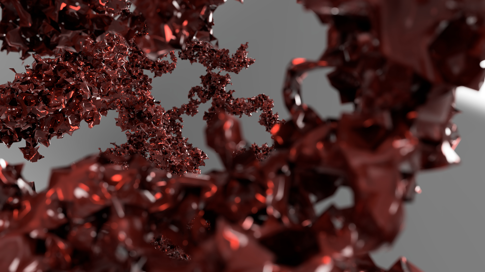
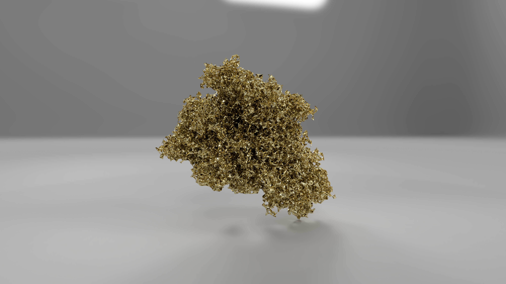

# Surface and volume reinforced random walk modelling

- [1]
Van Nieuwenburg E. P. L., Liu Y. H., Huber S. D. Learning phase transitions
by confusion //Nature Physics. – 2017. – Т. 13. – No. 5. – С. 435.

- [2]
Zhang Y., Kim E. A. Quantum loop topography for machine learning
//Physical review letters. – 2017. – Т. 118. – No. 21. – С. 216401.

- [3]
Ch’Ng K. et al. Machine learning phases of strongly correlated fermions
//Physical Review X. – 2017. – Т. 7. – No. 3. – С. 031038.

- [4]
Sapozhnikov V. B. Self-attracting walk with nu< 1/2 //Journal of Physics A:
Mathematical and General. – 1994. – Т. 27. – No. 6. – С. L151.

- [5]
Ordemann A. et al. Swelling-collapse transition of self-attracting walks
//Physical Review E. – 2000. – Т. 61. – No. 2. – С. R1005.

- [6]
Foster J. G., Grassberger P., Paczuski M. Reinforced walks in two and three
dimensions //New Journal of Physics. – 2009. – Т. 11. – No. 2. – С. 023009.

- [7]
Kozma G. Reinforced random walk //arXiv preprint arXiv:1208.0364. – 2012.
